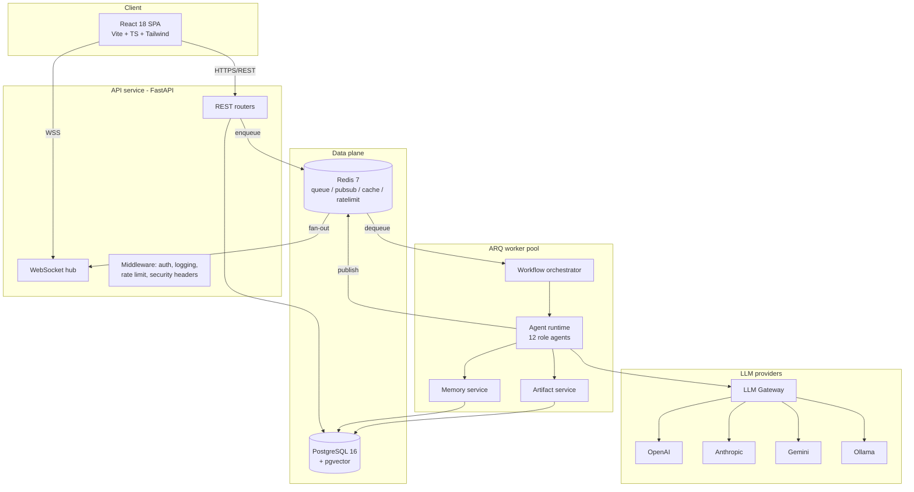
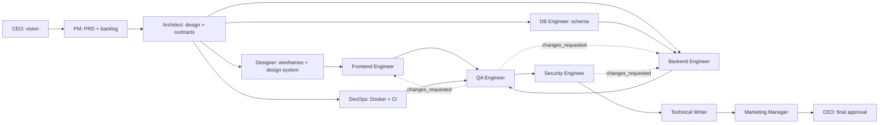

# System Architecture — AI Software Company

A multi-agent platform where 12 specialized AI "employees" collaborate to turn a one-line
prompt into a complete, versioned software project. Users manage the company through a
real-time dashboard; agents plan, build, review each other, and iterate — bounded by
hard cost and loop limits.

## 1. Component Overview

```
                        ┌──────────────────────────────┐
                        │   React SPA (Vite, TS)       │
                        │  dashboard · kanban · files  │
                        └──────┬───────────────┬───────┘
                          REST │        WS     │
                        ┌──────▼───────────────▼───────┐
                        │      FastAPI (presentation)   │
                        │  routers · ws · middleware    │
                        ├───────────────────────────────┤
                        │        application layer      │
                        │ project/auth/artifact/notify  │
                        │ orchestrator · workflow engine│
                        ├───────────────────────────────┤
                        │          domain layer         │
                        │ entities · policies · ports   │
                        ├───────────────────────────────┤
                        │      infrastructure layer     │
                        │ SQLAlchemy · Redis · LLM SDKs │
                        └──┬─────────┬─────────┬────────┘
                           │         │         │
                 ┌─────────▼──┐ ┌────▼────┐ ┌──▼──────────────┐
                 │ Postgres16 │ │ Redis 7 │ │ LLM providers    │
                 │ + pgvector │ │ ARQ/pub │ │ OpenAI/Anthropic │
                 └────────────┘ │ sub/rate│ │ Gemini/Ollama    │
                                └────┬────┘ └─────────────────┘
                                     │
                              ┌──────▼───────┐
                              │  ARQ worker  │  (agent task execution,
                              │  processes   │   horizontally scalable)
                              └──────────────┘
```



### Processes (Docker Compose services)

| Service    | Image            | Role                                                        |
|------------|------------------|-------------------------------------------------------------|
| `api`      | backend image    | FastAPI: REST + WebSockets, auth, metrics, health           |
| `worker`   | backend image    | ARQ worker: runs agent tasks, orchestrates workflows        |
| `frontend` | frontend image   | Nginx serving the built SPA, proxies `/api` and `/ws`       |
| `postgres` | postgres16 + pgvector | System of record + semantic memory embeddings          |
| `redis`    | redis:7          | ARQ task queue, pub/sub fan-out, cache, rate limiting       |

`api` and `worker` share one codebase/image; the worker simply runs `arq app.worker.WorkerSettings`.
Both are stateless — scale horizontally; Redis pub/sub fans WebSocket events out across
API replicas, ARQ distributes tasks across worker replicas.

## 2. Clean Architecture layers

Dependencies point inward only: `presentation → application → domain ← infrastructure`.

- **domain** — pure Python: entities (`Project`, `Task`, `Artifact`, `AgentMessage`, …),
  value objects (`Budget`, `Verdict`, `TaskStatus`), domain policies (revision-loop limit,
  budget check), and **ports** (abstract interfaces: `LLMGateway`, `EventBus`,
  `ProjectRepository`, `MemoryStore`, …). No FastAPI, SQLAlchemy, or Redis imports.
- **application** — use cases and services that orchestrate domain objects through ports:
  `ProjectService`, `WorkflowEngine`, `Orchestrator`, `MemoryService`, `ArtifactService`,
  `AuthService`, `NotificationService`. Transaction boundaries live here.
- **infrastructure** — adapters implementing the ports: SQLAlchemy repositories, Redis
  event bus / cache / rate limiter, ARQ scheduler, LLM provider adapters, pgvector store.
- **presentation** — FastAPI routers, WebSocket endpoints, Pydantic request/response
  schemas, dependency wiring, middleware.

Extension points are plugin-style registries (agent registry, LLM provider registry):
adding an agent or provider requires **no core changes** (see `docs/agent-internals.md` §9).

## 3. The AI Company — workflow

Roles: CEO, Product Manager, Software Architect, UI/UX Designer, Frontend Engineer,
Backend Engineer, Database Engineer, DevOps Engineer, QA Engineer, Security Engineer,
Technical Writer, Marketing Manager.

The orchestrator compiles each project into a task DAG:



- Independent branches (Designer ∥ DB Engineer; Frontend ∥ Backend ∥ DevOps) run in
  parallel via ARQ.
- QA/Security produce structured verdicts; `changes_requested` routes a revision task
  back to the responsible engineer, bounded at **3 revision loops per agent pair** —
  after that the workflow pauses in `NEEDS_ATTENTION` and the user is notified.
- Optional human-in-the-loop: a project flag turns CEO/QA/Security gates into pause
  points that wait for user approval.

## 4. Cost & safety controls (enforced, not advisory)

| Control                       | Default        | Behavior on breach                             |
|-------------------------------|----------------|------------------------------------------------|
| Per-project token budget      | 2,000,000 tok  | Workflow → `NEEDS_ATTENTION`, notify user       |
| Per-agent max iterations      | 10             | Task fails → dead-letter, workflow pauses       |
| Revision loops per agent pair | 3              | Loop stops, workflow → `NEEDS_ATTENTION`        |
| Global workflow timeout       | 60 min         | Workflow → `NEEDS_ATTENTION`                    |
| LLM call retries              | 3 (backoff+jitter) | Circuit breaker opens after 5 consecutive fails |
| Task retries                  | 2              | Dead-letter queue, workflow pauses              |

Every LLM call records prompt/completion tokens and computed cost to `llm_calls`;
budget checks run **before** each call.

## 5. Real-time pipeline

1. Agent/worker emits a domain event (message created, task status change, artifact saved).
2. Event is persisted to Postgres, then published to Redis channel `events:{project_id}`
   (and `events:user:{user_id}` for notifications).
3. Every API replica runs a pub/sub listener; connected WebSocket clients subscribed to
   that project receive the JSON event.
4. WS connections authenticate with the JWT access token on connect
   (`/ws?token=…`), and are dropped on token expiry.

Ordering: events carry a monotonic `seq` per project; the client re-syncs via REST if a
gap is detected.

## 6. Observability & production posture

- **Logging** — structlog JSON logs; every request gets a `correlation_id`
  (propagated into ARQ tasks and LLM calls); request/response logging middleware.
- **Metrics** — Prometheus `/metrics`: HTTP latency histograms, queue depth,
  tokens/cost counters per provider+agent, agent task duration histograms.
- **Health** — `/health` (liveness) and `/ready` (DB + Redis ping) on every service;
  Compose healthchecks gate startup order.
- **Errors** — typed exception hierarchy → single envelope
  `{"error": {"code", "message", "details", "correlation_id"}}`.
- **Security** — JWT access (15 min) + rotating refresh (7 d), bcrypt, RBAC
  (`admin`/`member`), Redis sliding-window rate limits on auth + project creation,
  strict CORS, security headers, Pydantic validation on every endpoint.

## 7. Generated-project artifact pipeline

Agents never write to disk. They emit `{path, content, language}` JSON; the artifact
service **statically validates** (ruff/tsc-style linting where applicable — generated
projects are *not executed*), computes a SHA-256 content hash, assigns a version number
(full history kept), and stores rows in Postgres. The file explorer and the ZIP download
endpoint read from this service. Sandboxed execution is a documented future extension.

## 8. Scaling & K8s migration path (not built)

Compose is the deliverable. Because `api`/`worker` are stateless and all coordination
goes through Postgres/Redis, migration to Kubernetes is mechanical: one Deployment per
service, HPA on the worker (queue-depth metric), managed Postgres/Redis, Ingress for the
SPA + API. No code changes required.

## 9. Repository layout

```
.
├── backend/
│   ├── app/
│   │   ├── main.py                  # FastAPI factory
│   │   ├── worker.py                # ARQ worker settings
│   │   ├── core/                    # config, logging, errors, security, metrics
│   │   ├── domain/
│   │   │   ├── entities/            # project, task, artifact, message, user, ...
│   │   │   ├── value_objects.py     # enums, Budget, Verdict, ...
│   │   │   ├── policies.py          # loop limits, budget policy
│   │   │   └── ports/               # abstract interfaces (repos, gateway, bus, ...)
│   │   ├── application/
│   │   │   ├── services/            # project, auth, artifact, memory, notification
│   │   │   ├── orchestration/       # orchestrator, workflow engine, dag
│   │   │   └── dto.py
│   │   ├── infrastructure/
│   │   │   ├── db/                  # engine, models, repositories, uow
│   │   │   ├── redis/               # event bus, cache, rate limiter, queue
│   │   │   ├── llm/                 # gateway + openai/anthropic/gemini/ollama adapters
│   │   │   └── memory/              # pgvector store, embedder
│   │   ├── agents/
│   │   │   ├── base.py              # Agent interface + runtime
│   │   │   ├── registry.py          # plugin registry
│   │   │   ├── schemas.py           # structured output JSON schemas
│   │   │   └── configs/*.yaml       # one YAML per employee
│   │   └── presentation/
│   │       ├── api/                 # routers: auth, projects, tasks, artifacts, ...
│   │       ├── ws.py                # WebSocket hub
│   │       ├── schemas/             # Pydantic request/response models
│   │       ├── middleware.py
│   │       └── deps.py
│   ├── alembic/                     # migrations
│   ├── tests/                       # unit / integration
│   └── pyproject.toml
├── frontend/
│   ├── src/
│   │   ├── api/                     # typed client + TanStack Query hooks
│   │   ├── stores/                  # Zustand (auth, ui, realtime)
│   │   ├── components/              # layout, kanban, chat, files, charts, ...
│   │   ├── pages/                   # Dashboard, Project, Login, Settings, Analytics
│   │   ├── ws/                      # WebSocket client with reconnect
│   │   └── types/
│   ├── e2e/                         # Playwright
│   └── package.json
├── docs/                            # this file + schema + api + agent internals + ops
├── docker-compose.yml
└── .github/workflows/ci.yml
```

Companion documents: [database-schema.md](database-schema.md) ·
[api-reference.md](api-reference.md) · [agent-internals.md](agent-internals.md) ·
[deployment.md](deployment.md) · [runbook.md](runbook.md)
