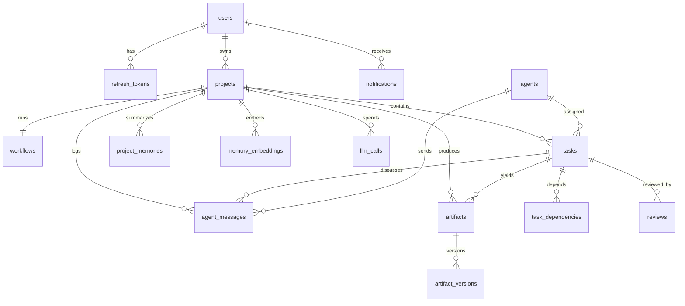

# Database Schema — PostgreSQL 16 (+ pgvector)

All tables use `id UUID PRIMARY KEY DEFAULT gen_random_uuid()`, `created_at TIMESTAMPTZ NOT NULL DEFAULT now()`,
and (where mutation happens) `updated_at TIMESTAMPTZ NOT NULL DEFAULT now()`. FKs are `ON DELETE CASCADE`
unless noted. Enum values are stored as `VARCHAR` + CHECK constraints (portable, Alembic-friendly).

## users
| column | type | notes |
|---|---|---|
| id | UUID PK | |
| email | VARCHAR(255) | UNIQUE, NOT NULL, lowercase |
| password_hash | VARCHAR(255) | bcrypt |
| full_name | VARCHAR(120) | NOT NULL |
| role | VARCHAR(16) | CHECK IN ('admin','member'), default 'member' |
| is_active | BOOLEAN | default true |
| created_at / updated_at | TIMESTAMPTZ | |

Indexes: `ux_users_email` (unique).

## refresh_tokens
| column | type | notes |
|---|---|---|
| id | UUID PK | |
| user_id | UUID FK → users | |
| token_hash | VARCHAR(64) | SHA-256 of the token; raw token never stored |
| expires_at | TIMESTAMPTZ | NOT NULL |
| revoked_at | TIMESTAMPTZ | NULL = active; rotation revokes old row |
| created_at | TIMESTAMPTZ | |

Indexes: `ux_refresh_token_hash` (unique), `ix_refresh_user` (user_id).

## agents  — the employee roster (seeded from YAML configs)
| column | type | notes |
|---|---|---|
| id | UUID PK | |
| key | VARCHAR(40) | UNIQUE — e.g. 'ceo', 'backend_engineer' |
| name | VARCHAR(80) | display name, e.g. "Ava Reyes" |
| role_title | VARCHAR(80) | e.g. "Backend Engineer" |
| personality | TEXT | short persona blurb |
| system_prompt | TEXT | full system prompt |
| provider | VARCHAR(20) | 'openai' \| 'anthropic' \| 'gemini' \| 'ollama' |
| model | VARCHAR(80) | e.g. 'claude-sonnet-5' |
| config | JSONB | temperature, max_tokens, tools, output schema key |
| is_active | BOOLEAN | default true |
| created_at / updated_at | TIMESTAMPTZ | |

## projects
| column | type | notes |
|---|---|---|
| id | UUID PK | |
| owner_id | UUID FK → users | |
| name | VARCHAR(120) | NOT NULL |
| prompt | TEXT | the user's one-line request |
| status | VARCHAR(24) | CHECK IN ('pending','planning','in_progress','review','needs_attention','completed','failed','cancelled') |
| token_budget | BIGINT | default 2_000_000 |
| tokens_used | BIGINT | default 0 (denormalized rollup of llm_calls) |
| cost_usd | NUMERIC(10,4) | default 0 |
| human_in_loop | BOOLEAN | default false — approval gates pause for user |
| settings | JSONB | per-project overrides (loop limits, timeout) |
| created_at / updated_at | TIMESTAMPTZ | |

Indexes: `ix_projects_owner` (owner_id), `ix_projects_status` (status).

## workflows  — one per project run
| column | type | notes |
|---|---|---|
| id | UUID PK | |
| project_id | UUID FK → projects | UNIQUE (current run) |
| status | VARCHAR(24) | same domain as project status |
| dag | JSONB | compiled DAG: nodes + edges snapshot |
| current_stage | VARCHAR(40) | e.g. 'engineering', 'qa' |
| started_at / finished_at | TIMESTAMPTZ | nullable |
| paused_reason | TEXT | why NEEDS_ATTENTION |
| deadline_at | TIMESTAMPTZ | started_at + global timeout |
| created_at / updated_at | TIMESTAMPTZ | |

## tasks
| column | type | notes |
|---|---|---|
| id | UUID PK | |
| project_id | UUID FK → projects | |
| workflow_id | UUID FK → workflows | |
| agent_id | UUID FK → agents | assignee (RESTRICT delete) |
| node_key | VARCHAR(60) | DAG node key, e.g. 'backend_impl' |
| title | VARCHAR(200) | |
| description | TEXT | instructions composed by orchestrator |
| status | VARCHAR(20) | CHECK IN ('pending','queued','running','review','revision','completed','failed','dead_letter') |
| attempt | SMALLINT | default 0; task-level retries (max 2) |
| revision_round | SMALLINT | default 0; bounded by loop policy (max 3) |
| output | JSONB | structured agent output |
| error | TEXT | last failure |
| queued_at / started_at / finished_at | TIMESTAMPTZ | for duration metrics |
| created_at / updated_at | TIMESTAMPTZ | |

Indexes: `ix_tasks_project_status` (project_id, status), `ix_tasks_agent` (agent_id),
`ux_tasks_workflow_node_round` UNIQUE (workflow_id, node_key, revision_round).

## task_dependencies
| column | type | notes |
|---|---|---|
| task_id | UUID FK → tasks | PK part |
| depends_on_task_id | UUID FK → tasks | PK part |

PK (task_id, depends_on_task_id); CHECK task_id <> depends_on_task_id.

## agent_messages  — every inter-agent message, persisted
| column | type | notes |
|---|---|---|
| id | UUID PK | |
| project_id | UUID FK → projects | |
| task_id | UUID FK → tasks | nullable (broadcasts) |
| sender_agent_id | UUID FK → agents | nullable (system/user messages) |
| recipient_agent_id | UUID FK → agents | nullable = broadcast |
| correlation_id | UUID | ties request → LLM call → response chain |
| seq | BIGINT | per-project monotonic (from sequence) — WS gap detection |
| message_type | VARCHAR(24) | 'assignment','result','review','revision_request','status','system' |
| content | TEXT | human-readable body (rendered in the chat UI) |
| payload | JSONB | structured content (verdicts, file lists, ...) |
| created_at | TIMESTAMPTZ | |

Indexes: `ix_msgs_project_seq` (project_id, seq), `ix_msgs_task` (task_id),
`ix_msgs_correlation` (correlation_id).

## artifacts  — logical files of the generated project
| column | type | notes |
|---|---|---|
| id | UUID PK | |
| project_id | UUID FK → projects | |
| path | VARCHAR(500) | e.g. 'src/App.tsx' |
| language | VARCHAR(30) | |
| latest_version | INT | default 1 |
| created_by_task_id | UUID FK → tasks | SET NULL |
| created_at / updated_at | TIMESTAMPTZ | |

Indexes: `ux_artifacts_project_path` UNIQUE (project_id, path).

## artifact_versions  — full history, content-addressed
| column | type | notes |
|---|---|---|
| id | UUID PK | |
| artifact_id | UUID FK → artifacts | |
| version | INT | 1..n |
| content | TEXT | full file content |
| content_hash | CHAR(64) | SHA-256 |
| size_bytes | INT | |
| validation | JSONB | lint/type-check results `{tool, ok, issues[]}` |
| created_by_task_id | UUID FK → tasks | SET NULL |
| created_at | TIMESTAMPTZ | |

Indexes: `ux_artifact_version` UNIQUE (artifact_id, version), `ix_artifact_hash` (content_hash).

## reviews  — QA / Security / CEO verdicts
| column | type | notes |
|---|---|---|
| id | UUID PK | |
| project_id | UUID FK → projects | |
| task_id | UUID FK → tasks | the reviewed task |
| reviewer_agent_id | UUID FK → agents | |
| verdict | VARCHAR(20) | CHECK IN ('approved','changes_requested') |
| reasons | JSONB | array of {severity, area, description, suggestion} |
| round | SMALLINT | which revision round this verdict closed |
| created_at | TIMESTAMPTZ | |

## project_memories  — tier-2 summarized decisions
| column | type | notes |
|---|---|---|
| id | UUID PK | |
| project_id | UUID FK → projects | |
| category | VARCHAR(30) | 'decision','requirement','constraint','summary' |
| content | TEXT | concise summary bullet |
| source_task_id | UUID FK → tasks | SET NULL |
| created_at | TIMESTAMPTZ | |

Indexes: `ix_pm_project_cat` (project_id, category).

## memory_embeddings  — tier-3 semantic memory (pgvector)
| column | type | notes |
|---|---|---|
| id | UUID PK | |
| project_id | UUID FK → projects | nullable — cross-project knowledge allowed |
| kind | VARCHAR(20) | 'artifact','conversation','decision' |
| ref_id | UUID | id of the source row |
| content | TEXT | embedded chunk |
| embedding | VECTOR(1536) | pgvector |
| created_at | TIMESTAMPTZ | |

Indexes: `ix_membed_hnsw` HNSW (embedding vector_cosine_ops), `ix_membed_project` (project_id).

## llm_calls  — token/cost ledger
| column | type | notes |
|---|---|---|
| id | UUID PK | |
| project_id | UUID FK → projects | nullable (system calls) |
| task_id | UUID FK → tasks | SET NULL |
| agent_id | UUID FK → agents | SET NULL |
| correlation_id | UUID | |
| provider | VARCHAR(20) | |
| model | VARCHAR(80) | |
| prompt_tokens / completion_tokens | INT | |
| cost_usd | NUMERIC(10,6) | computed from a price table |
| latency_ms | INT | |
| status | VARCHAR(16) | 'ok','error','timeout' |
| error | TEXT | nullable |
| created_at | TIMESTAMPTZ | |

Indexes: `ix_llm_project` (project_id), `ix_llm_agent_created` (agent_id, created_at).

## notifications
| column | type | notes |
|---|---|---|
| id | UUID PK | |
| user_id | UUID FK → users | |
| project_id | UUID FK → projects | nullable |
| type | VARCHAR(30) | 'workflow_completed','needs_attention','approval_required',... |
| title | VARCHAR(200) | |
| body | TEXT | |
| read_at | TIMESTAMPTZ | NULL = unread |
| created_at | TIMESTAMPTZ | |

Indexes: `ix_notif_user_unread` (user_id) WHERE read_at IS NULL.

## Sequences
`project_event_seq` per project is implemented as `agent_messages.seq` drawn from a
shared BIGSERIAL-style sequence `event_seq`; ordering only needs to be monotonic, not gapless.
